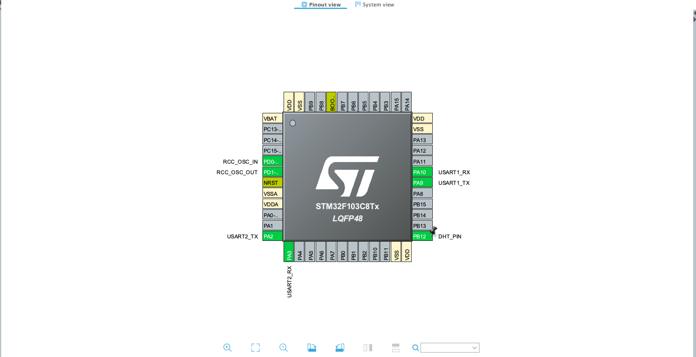
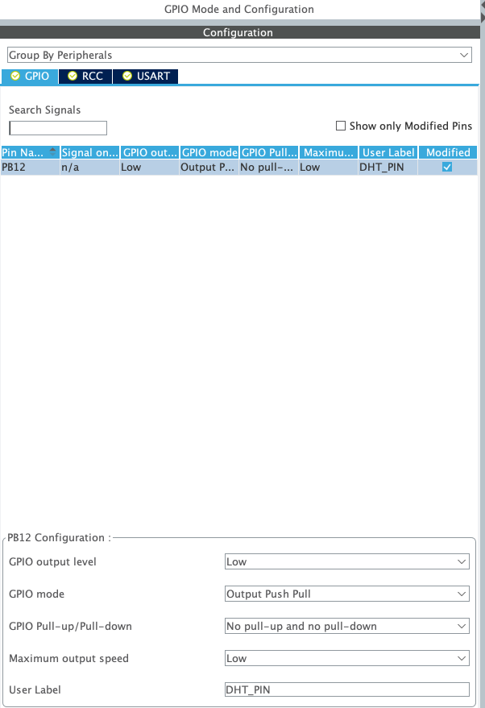
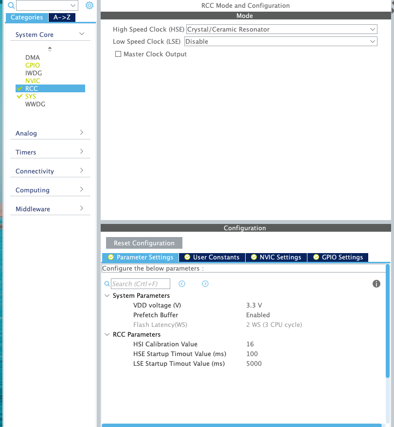
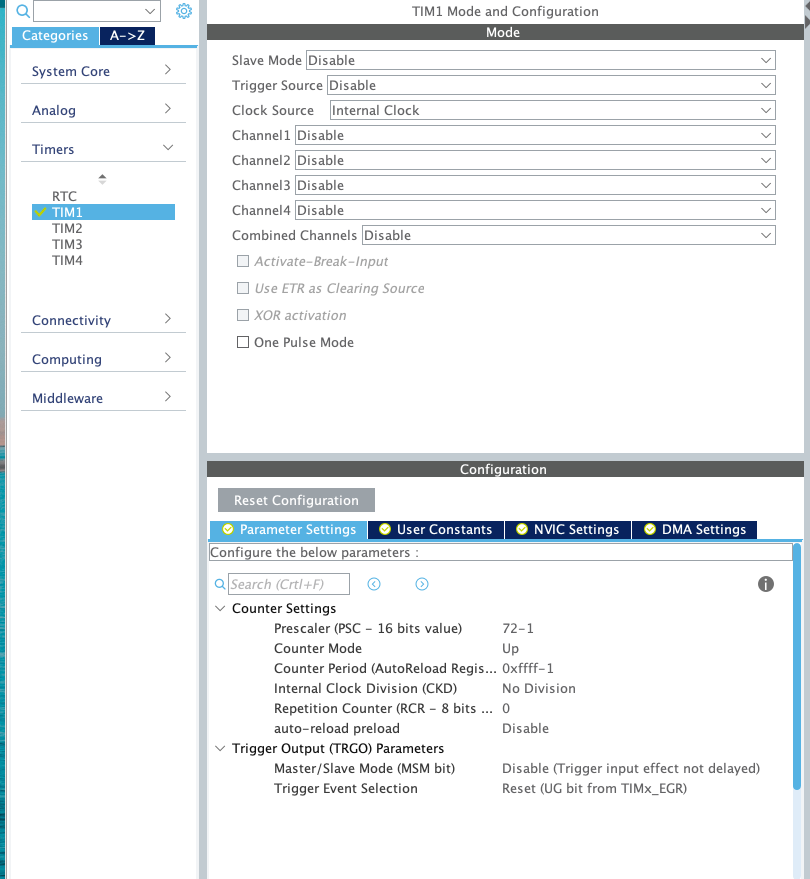
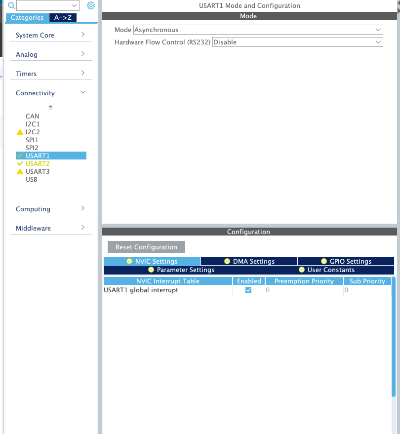
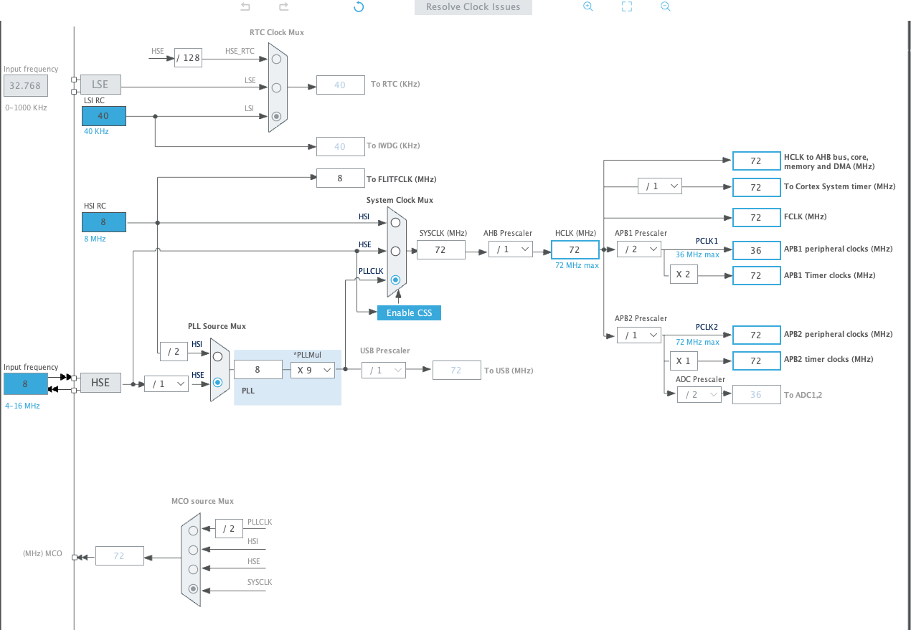
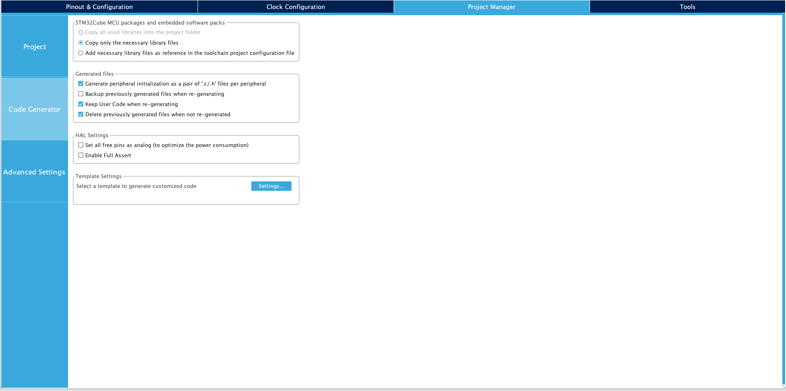
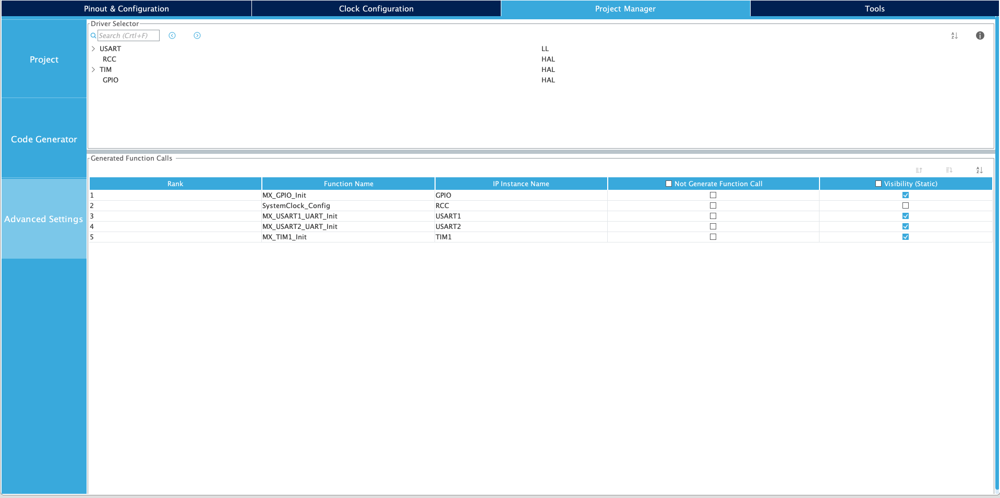

# Africa's Talking Eris v1 Dev Kit DHT Sample

## TLDR; 

> To get **up and running quickly** with this sample follow the steps below:

1. Hook the DHT Sensor to `PB12` on the board

2. Flash `./Dist/dhtreeader.bin` in to your dev kit. 

3. Open Serial to view data


> For a detailed write up, reead below

## Pinout Configuration

- See overrall config as shown below 


- Set `PB12` to `GPIOOutput` as shown
 

- Set `HSE` to `Crystal/Ceramic Resonator` and **disable** `LSE` as shown
 

- Under timer config set `Clock Source` to `Internal Clock` for `TIM1`.
- Set prescaler value to `72 - 1` and ARR to `0xffff - 1`.
 

- Set serial mode to `Asynchronous` for both  `USART1` and `USART2` and **ensure `gloabl interrupt` is enabled under `NVIC Settings`** 
 

## Clock Configuration 
- See below clock configuration.
    - Toggle `PLL` and `PLLCLK`
    - Set input frequency to `8Mhz`

- You might want to set `PLLMul` to **11 or above** then click `Resolve Clock Issues` 


## Project Management 
- Under Project Manager ensure `Generate peripheral initialization...` is checked 
 

- Then inside `Advanced Settings` Set USART driver to `LL`  



**SAVE AND GENERATE PROJECT**

## Library Config

- Inside `./Core/Inc/main.h` ensure you have the following under `Private defines` .

```c 
#define DHT_PERIPHERAL GPIOB  

#define DHT_PIN GPIO_PIN_12
```

## Important Others 

- Note that the line shown below is commented under `./Core/Src/syscalls.c` 

```c 
extern int __io_putchar(int ch) __attribute__((weak)); 
``` 

- Also note that an IRQ handler is required for USART1; see `./Core/Src/stm32f1xx_it.c`.

- Note the **differences** under `./Core/{Src,Inc}/usart.{h,c}` 
